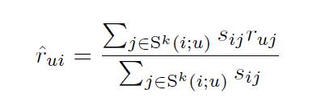
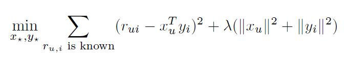

# Collaborative Filtering for Implicit Feedback Datasets

[论文原文](https://github.com/chenboability/RecommenderSystem-Paper/blob/master/Collaborative%20Filtering/paper/%5B2003%5D%20Item-to-Item%20Collaborative%20Filtering.pdf)

点赞、打分等显示反馈信息虽然可以直接反映用户的偏好，但是量是非常稀缺的，而且也难以体现用户对那些物品是不喜欢、不满意的，因此可以利用隐式反馈信息来弥补。

> 隐式反馈信息包括了：购买记录、浏览记录、搜索记录、鼠标的点击记录、页面逗留记录……这些信息不能直接反映用户对物品的评价

文章基于隐式反馈的主要特征：

- 没有负反馈
- 隐式反馈是有噪声的
- 隐式反馈中的数值代表频率的置信度（显式反馈中的数值代表用户偏好）
- 对隐式反馈的评价需要用到与以往不同的指标

## Neighborhood models

用户u对物品i的预测：

为用户u之前评价的k个物品集，是物品i和物品j的相似度，是用户u对物品j的评价。

## Latent factor models

Singular Value Decomposition (SVD)奇异值分解：

第一项是误差项，而第二项是正则化项。参数估计可以通过随机梯度下降SGD获取。

## paper model

