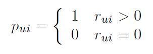
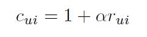
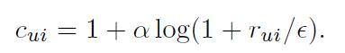
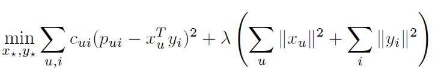
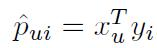
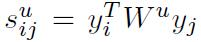

# Collaborative Filtering for Implicit Feedback Datasets

[论文原文](https://github.com/chenboability/RecommenderSystem-Paper/blob/master/Collaborative%20Filtering/paper/%5B2003%5D%20Item-to-Item%20Collaborative%20Filtering.pdf)

点赞、打分等显示反馈信息虽然可以直接反映用户的偏好，但是量是非常稀缺的，而且也难以体现用户对那些物品是不喜欢、不满意的，因此可以利用隐式反馈信息来弥补。

> 隐式反馈信息包括了：购买记录、浏览记录、搜索记录、鼠标的点击记录、页面逗留记录……这些信息不能直接反映用户对物品的评价

文章基于隐式反馈的主要特征：

- 没有负反馈
- 隐式反馈是有噪声的
- 隐式反馈中的数值代表频率的置信度（显式反馈中的数值代表用户偏好）
- 对隐式反馈的评价需要用到与以往不同的指标

## Neighborhood models

用户u对物品i的预测：

为用户u之前评价的k个物品集，是物品i和物品j的相似度，是用户u对物品j的评价。

## Latent factor models

Singular Value Decomposition (SVD)奇异值分解：

第一项是误差项，而第二项是正则化项。参数估计可以通过随机梯度下降SGD获取。

## Paper model

隐式反馈中可以获得的只有这个：
，表示用户u对物品i的某些交互（如看电视次数、浏览网页的次数），是一个频率。核心内容就是将
转换成另外两个值，即用户偏好和置信度。

用户偏好：

当频率超过一定阈值时，（不一定是公式中的0），用户偏好等于1.

置信度：
，可以看成是权重，下面两个公式都可以，还有其他利用来计算置信度的方法

  

因此，目标函数可以表示成：

其中是数据依赖的，可以通过交叉验证来计算。上述目标函数包含mn项，无法通过SGD方法优化，本文利用 **交替最小二乘法** 来优化目标函数。

最后，为用户u推荐K个预测评分最高的物品，预测公式如下：

## 推荐解释

利用交替最小二乘法中的优化步骤，可以得到在用户u视觉下，物品i和j的相似度：

因此，推荐解释可以用下式反映：

tip：通过这样，物品的相似度可以通过不同用户的视觉体现出来，，这可以充当上面的Neighborhood models的预处理步，用于计算物品相似度。

