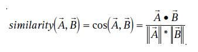
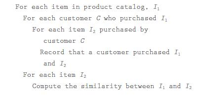

# Item-to-Item Collaborative Filtering

[论文原文](https://github.com/chenboability/RecommenderSystem-Paper/blob/master/Collaborative%20Filtering/paper/%5B2003%5D%20Item-to-Item%20Collaborative%20Filtering.pdf)

> 当下推荐系统面临的挑战：

- 用户数据与物品数据量巨大
- 实时性要求高
- 新用户、新物品冷启动问题
- 老用户的历史数据量大（时效性），如一位有着10年淘宝经历的用户拥有各式各样的历史记录，如何正确过滤
- 算法需要对用户新数据具有较快的推荐能力，如用户搜索手机，应该对该新数据进行足够精准的推荐

## Traditional Collaborative Filtering

基于用户的协同过滤，计算用户的相似度，如余弦相似度：

推荐的方法一般是从相似用户的物品列表中去除该用户已有的物品进行推荐，可以对多个相似用户的物品列表进行排序，推荐top N的物品。

时间复杂度为O（MN），M、N分别是用户和物品的数量，而由于矩阵的稀疏性，实际的复杂度接近O(M + N)。

减小M的优化方法：

1. 随机抽样
2. 去除物品列表少于某个阈值的用户
3. PCA或聚类等降维方法

减小N的优化方法：

1. 去除受欢迎和不受欢迎的物品
2. 基于物品类别，将物品空间分割成多个，从而减少物品量
3. PCA或聚类等降维方法

## Cluster Models

思想：Using a similarity metric, a clustering
algorithm groups the most similar customers
together to form clusters.

优点：与协同过滤算法相比，具有更好的实时性。因为这种方法比较的量是每一个聚成后的类，而不是整个大的原始数据，大大减少计算量。

缺点：性能比协同过滤差，由于聚类的粗糙性。

## Search-Based Methods

思想：Given the user’s purchased and rated
items, the algorithm constructs a search query to
find other popular items by the same author,
artist, or director, or with similar keywords or
subjects.（基于内容）

优点：用户历史数据少的时候，可以推荐的范围比较大。

缺点：用户的历史数据量大的时候，无所适从；整体推荐结果较差；推荐的结果要么太泛（由成龙的电影推荐到各种香港电影或功夫电影），要么太窄（将成龙的所有电影都推荐），新颖性不好。

## Item-to-Item Collaborative Filtering

特征：item-to-item collaborative
filtering, scales to massive data sets and produces
high-quality recommendations in real time（海量数据、实时性）

计算物品相似性的算法（只计算有同时购买记录的）如下，计算的指标可以用余弦相似性，时间复杂度为O(N2M)。--离线

接着，推荐最受欢迎的或者与已有记录相似度最高的物品。--在线

优点：

- 离线计算（物品的相似度可以离线计算）；
- 在线计算（寻找相似物品的量是独立于用户数，只与用户购买数有关）

