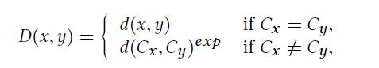
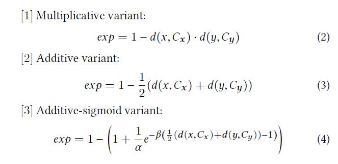
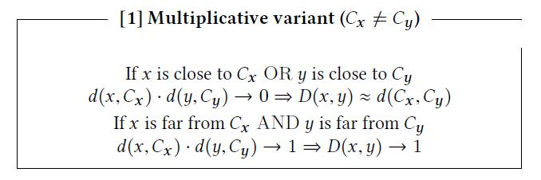
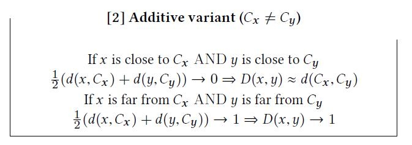
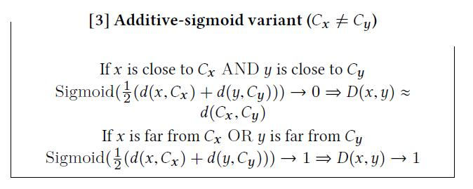

# Top-N Recommender System via Matrix Completion

[论文原文](https://github.com/chenboability/RecommenderSystem-Paper/blob/master/Collaborative%20Ranking/paper/%5B2016%5D%20%5BSIGIR%20A%5D%20%5BCollaborative%20Ranking%20with%20Social%20Relationships%20for%20Top-N%20Recommendations%5D.pdf)

> 这篇文章就是做了一个工具，用于CF的邻居发现过程。

传统的CF的邻居发现过程一般是用聚类算法，邻居都只能是同一个类中的其他用户/物品。但是，有些聚类算法效果一般，可能最近的邻居处于其他类中，这篇文章就是做了这样一点改进。

距离的计算：

指数有三种选择：

分别对应的解释：

