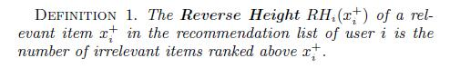
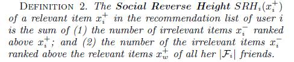
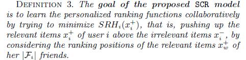
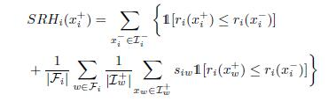
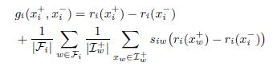
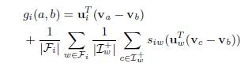
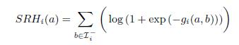
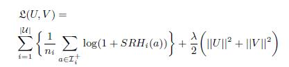
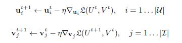

# Collaborative Ranking with Social Relationships for Top-N Recommendations

[论文原文](https://github.com/chenboability/RecommenderSystem-Paper/blob/master/Collaborative%20Ranking/paper/%5B2016%5D%20%5BSIGIR%20A%5D%20%5BCollaborative%20Ranking%20with%20Social%20Relationships%20for%20Top-N%20Recommendations%5D.pdf)

> 利用CR模型，结合社交关系，实现top N推荐

## 三个定义

## SOCIAL COLLABORATIVE RANKING

根据定义2，我们可以获得：

公式前部分是用户自身的物品评分；后部分是所有好友的评分之和。})是一个与特定用户i有关的个性化评分函数（personalized ranking function）。定义如下：

方便表示，记,，那么上式可以表示为：

因此，本节的第一个公式可以重写为：

目标函数log-log loss function为：

最小化上述的目标函数，可以采用交替最小化策略（alternating minimization strategy），利用梯度下降算法，交替优化。

