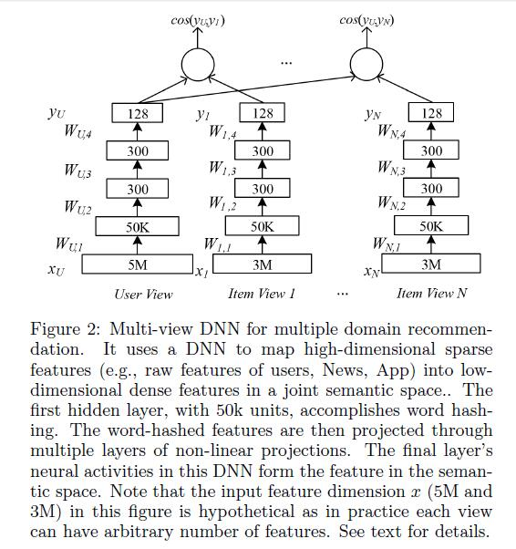

# A multi-view deep learning approach for cross domain user modeling in recommendation systems

[论文原文](https://github.com/chenboability/RecommenderSystem-Paper/blob/master/Deep%20Learning/paper/A%20multi-view%20deep%20learning%20approach%20for%20cross%20domain%20user%20modeling%20in%20recommendation%20systems.pdf)

## 框架

利用dssm模型，使用不同域的数据（新闻、电影等），构造多视图的dssm模型，进行推荐

