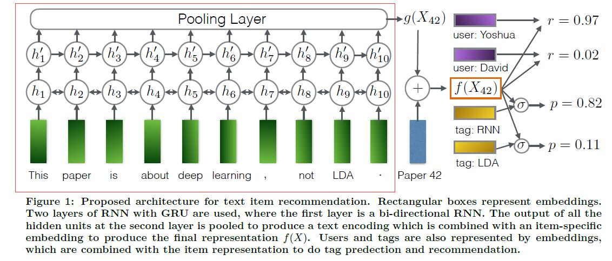
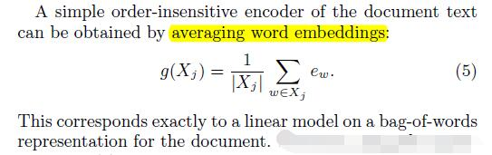
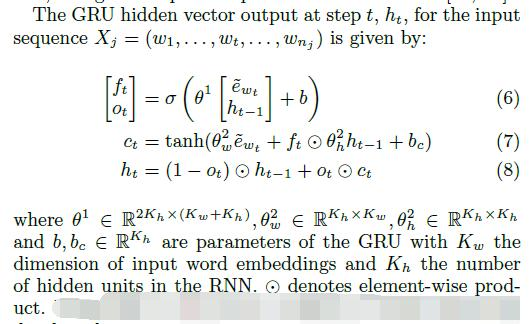
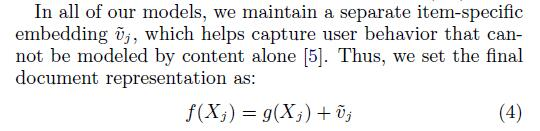
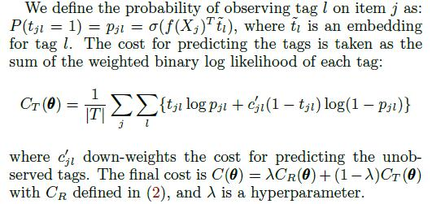
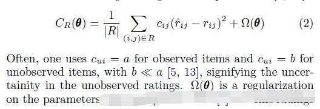

# Ask the GRU: Multi-Task Learning for Deep Text Recommendations

[论文原文](https://github.com/chenboability/RecommenderSystem-Paper/blob/master/Deep%20Learning/paper/Ask%20the%20gru%20Multi-task%20learning%20for%20deep%20text%20recommendations.pdf)

## 框架

## Encoders

将物品的content映射到一个隐因子空间

### Order-Insensitive Encoders

无序。先将每一个词，利用word embedding生成一个向量，接着平均所有词向量，得到一个物品的向量

### Order-Sensitive Encoders

有序。利用RNN实现，具体为GRU模型。GRU:

### 整合

最后，加上一个物品相关的embedding向量。

## Multi-Task Learning

