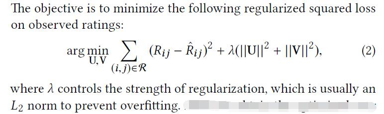
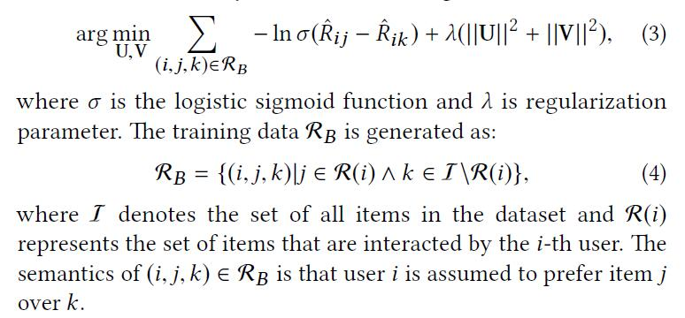
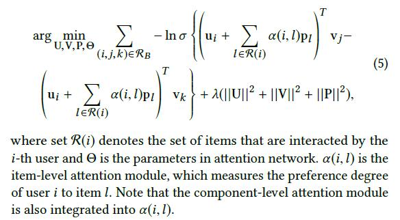
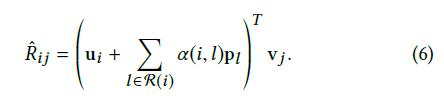
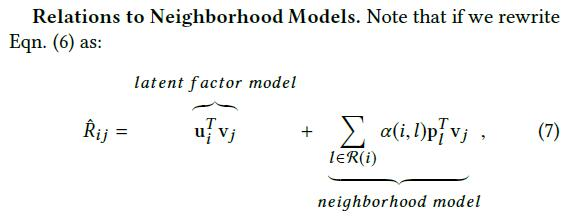
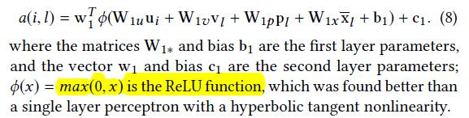
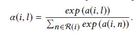
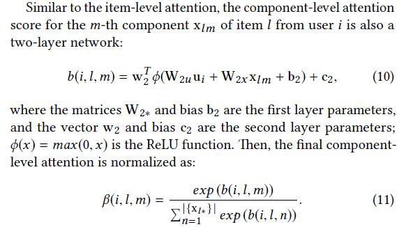

# Attentive Collaborative Filtering: Multimedia Recommendation with Item- and Component-Level Attention

[论文原文](https://github.com/chenboability/RecommenderSystem-Paper/blob/master/Deep%20Learning/paper/Attentive%20Collaborative%20Filtering%20Multimedia%20Recommendation%20with%20Item-%20and%20Component-Level%20Attention.pdf)

> attention-based CF

## PRELIMINARIES

### Latent Factor Models

point-wise loss

缺点：applying SVD in implicit feedback domain raises
difficulties due to the high portion of unobservable data.

### Bayesian Personalized Ranking (BPR)

pair-wise loss

## ATTENTIVE COLLABORATIVE FILTERING

### General Framework

目标函数（从BPR借鉴）：

其中)表示用户i对j的兴趣度，即item-级的attention。

评分预测：

模型的解释（与Neighborhood Models关系）：

因为the weights should be highly dependent to the user and the item content，因此作者设计了一个动态计算用户相关的权值计算方法。

### Item-Level Attention

权值的计算，利用一个两层网络：

### Component-Level Attention

权值的计算，同样是一个两层网络：

