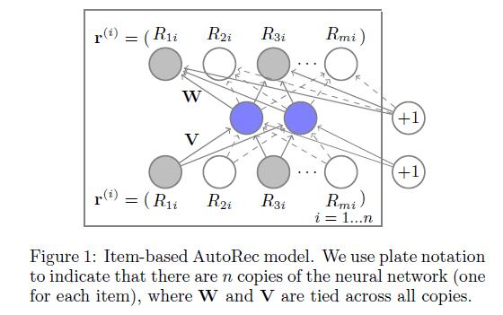
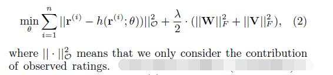
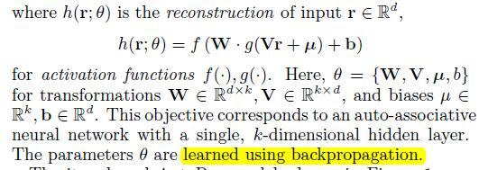

# AutoRec: Autoencoders Meet Collaborative Filtering

[论文原文](https://github.com/chenboability/RecommenderSystem-Paper/blob/master/Deep%20Learning/paper/autorec.pdf)

> 利用自编码器，将观察向量映射到一个低维的隐式空间（隐层），然后再重构到输出空间，对评分进行预测。

## Item-based 框架

目标函数：

