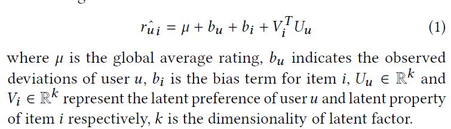
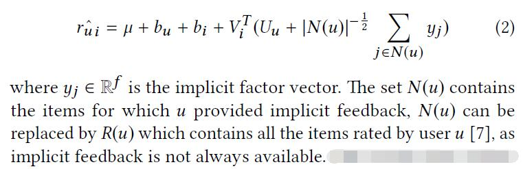
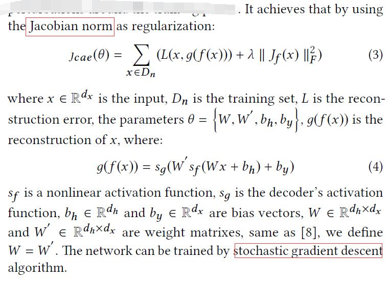
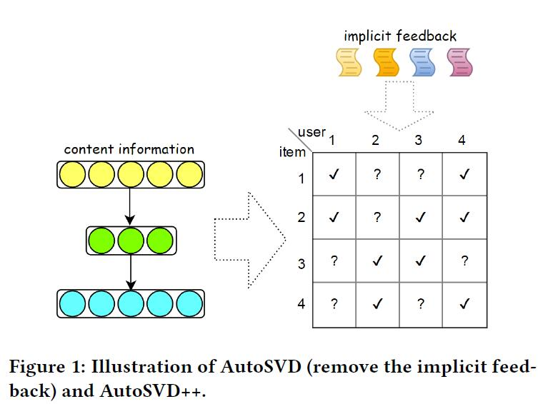
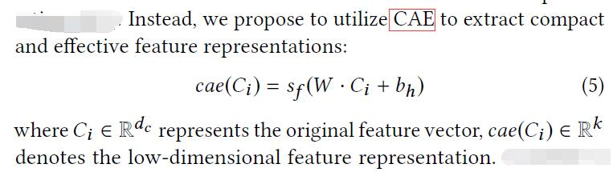
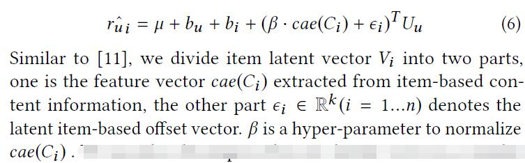
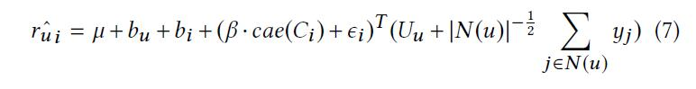

# AutoSVD++: An Efficient Hybrid Collaborative Filtering Model via Contractive Auto-encoders

[论文原文](https://github.com/chenboability/RecommenderSystem-Paper/blob/master/Deep%20Learning/paper/AutoSVD%2B%2B.pdf)

## Latent Factor Models & Contractive Auto-encoders
### Latent Factor Models
#### Biased SVD

引入用户偏差和物品偏差：

#### SVD++

引入隐式反馈：

### Contractive Auto-encoders

## PROPOSED METHODOLOGY

框架：

### AutoSVD

利用CAE提取特征：

预测得分：

### AutoSVD++

