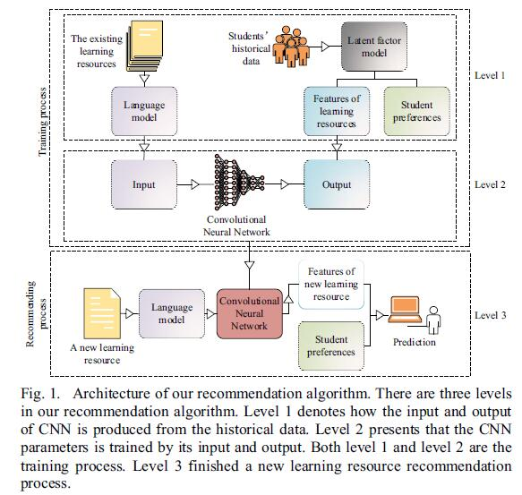
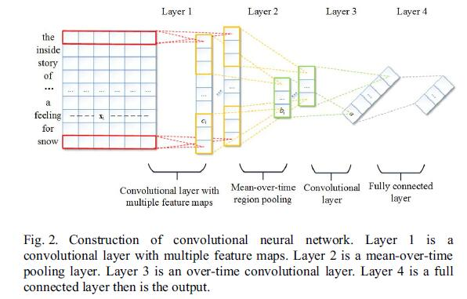
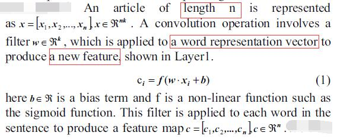
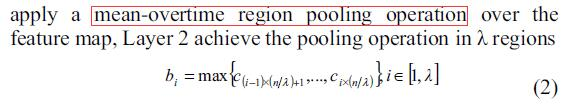
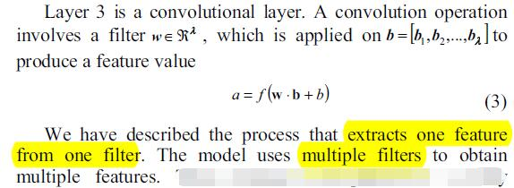
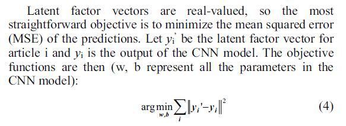

# Automatic Recommendation Technology for Learning Resources with Convolutional Neural Network

[论文原文](https://github.com/chenboability/RecommenderSystem-Paper/blob/master/Deep%20Learning/paper/Automatic%20Recommendation%20Technology%20for%20Learning%20Resources%20with%20Convolutional%20Neural%20Network.pdf)

## 框架

第二次的CNN框架：

## Construction of the CNN model（第二层）

CNN包含的4层：

第一层：卷积层

先对每个词构造词向量，然后对每一个词向量进行卷积

第二层：pooling层

第三层：卷积层

第四层：全连接层

## CNN网络的训练

利用LFM隐因子模型输出的V和CNN输出的V，最小化它们的误差MSE：

## CNN output solved by latent factor model

LFM模型-L1范式：

## CNN input computing by language model（词向量化）

represent a word as the probability that belongs to the topics.

利用Latent Dirichlet Allocation (LDA) 来训练topic model.

