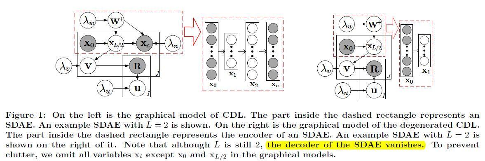
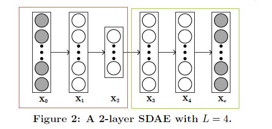
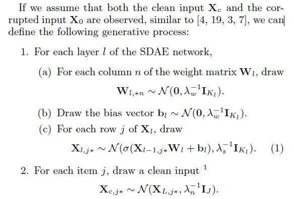
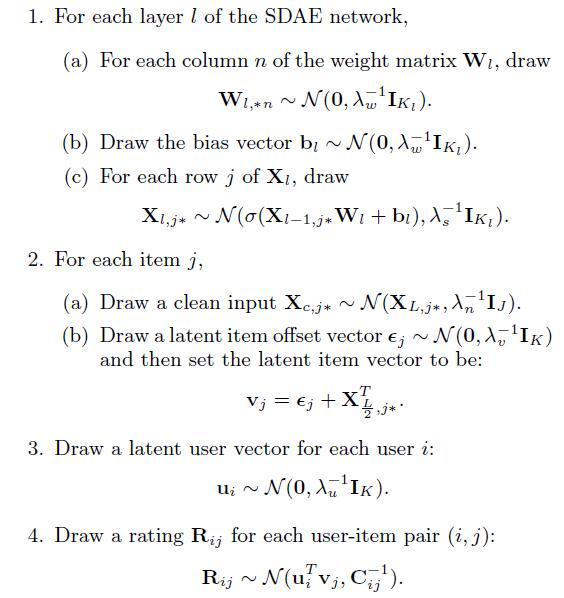
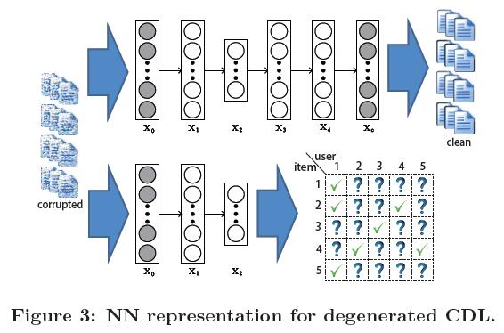

# Collaborative Deep Learning for Recommender Systems

[论文原文](https://github.com/chenboability/RecommenderSystem-Paper/blob/master/Deep%20Learning/paper/Collaborative%20deep%20learning%20for%20recommender%20systems.pdf)

## CDL框架

## Stacked Denoising Autoencoders(SDAE)

SDAE is a feedforward neural network for learning
representations (encoding) of the input data by learning to predict the clean input itself in the output.SDAE框架如下：

前L/2层构成一个编码器，后面L/2层构成解码器

## Generalized Bayesian SDAE

## CDL

