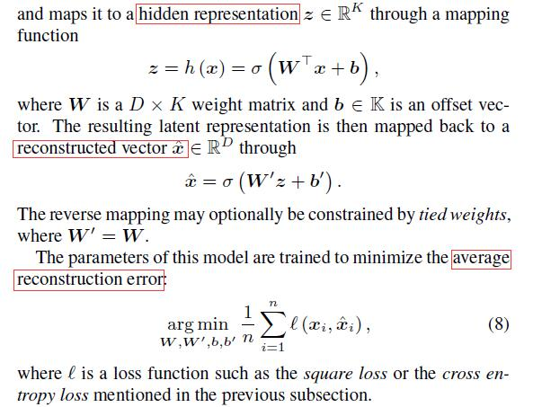
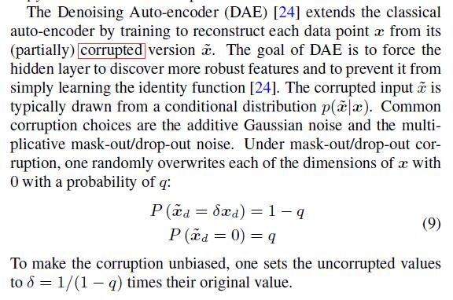
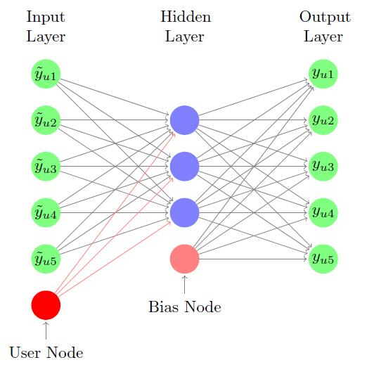
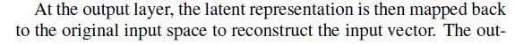
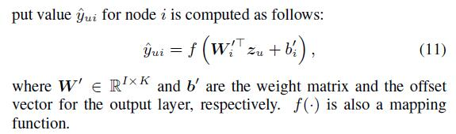
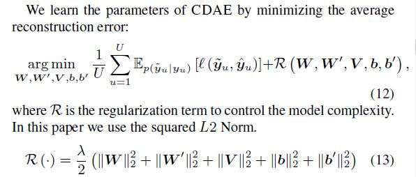

# Collaborative Denoising Auto-Encoders for Top-N Recommender Systems

[论文原文](https://github.com/chenboability/RecommenderSystem-Paper/blob/master/Deep%20Learning/paper/Collaborative%20Denoising%20Auto-Encoders%20for%20Top-N%20Recommender%20Systems.pdf)

## Denoising Auto-Encoders

1、 classical auto-encoder

2、 Denoising Auto-encoder (DAE)

## CDAE
三个层：the input layer, the hidden layer and the output layer（单隐层结构）

结构如下：

第一步：将输入映射成低维的隐式表

第二步：将低维的隐式表达恢复到原始输入空间

参数的学习：最小化重构误差

