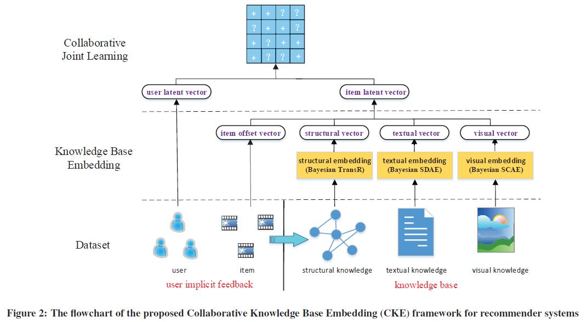
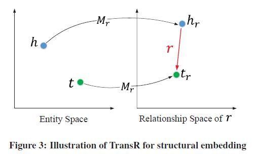
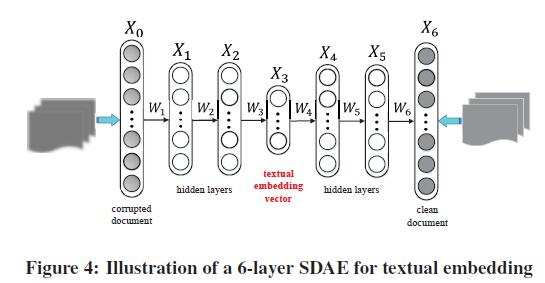
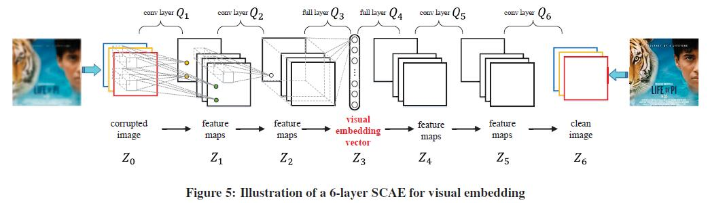

# Collaborative Knowledge Base Embedding for Recommender Systems

[论文原文]()

## Knowledge Base

knowledge base can be divided into three parts: 

- structural knowledge
- textual knowledge
- visual knowledge

## OVERVIEW

Our model mainly consists of two steps: 

- knowledge base embedding
- collaborative joint learning

## KNOWLEDGE BASE EMBEDDING

### Structural Embedding

对实体-关系进行处理，采用Bayesian TransR

### Textual Embedding

对文本进行处理，采用6-layer stacked denoising autoencoders (SDAE)

### Visual Embedding

对图像进行处理，采用6-layer stacked convolutional auto-encoders (SCAE)

