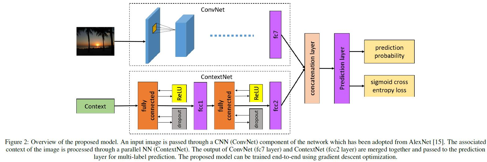
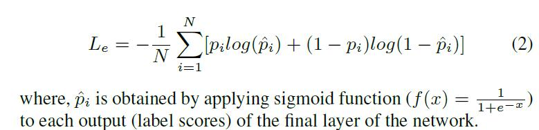

# ConTagNet: Exploiting User Context for Image Tag Recommendation

[论文原文](https://github.com/chenboability/RecommenderSystem-Paper/blob/master/Deep%20Learning/paper/ConTagNet%20exploiting%20user%20context%20for%20image%20tag%20recommendation.pdf)

> 图片的标签推荐，利用图片内容+图片元数据（时间、地点）

## 框架

## ConvNet

图片的特征提取选择AlexNet网络

## ContextNet

输入数据：6-dimensional feature vector
using geo-coordinates (latitude with a range of -90.0 to 90.0 and
longitude with a range of -180 to 180) and time (time in minutes with
a range of 0 to 1439, weekday with a range 0-6, month with a range
1-12 and day with a range 1-31).

预处理：zero mean and unit variance

2-layered neural network with fully connected layers

rectified linear units(ReLU) (f(x) = max(0; x)) as activation functions for these layers and each of the layer comprises of 512 neurons.

## 网络融合

两个网络结果串联，a fully connected layer

## 标签推荐

softmax normalization

## 训练

CNN网络是预训练好的

其余部分的参数，通过sigmoid cross-entropy loss训练

目标函数：

dropout rate of 0.5 for all the projection layers to avoid over-fitting
