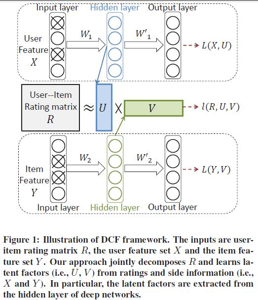
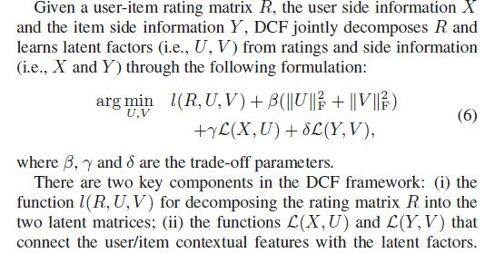
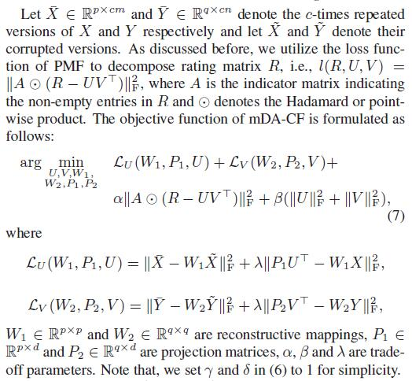

# Deep Collaborative Filtering via Marginalized Denoising Auto-encoder

[论文原文]()

## Deep Collaborative Filtering (DCF): A General Framework

DCF框架：

## DCF using PMF + mDA

mDA is a powerful tool in extracting high-level features from raw inputs.

