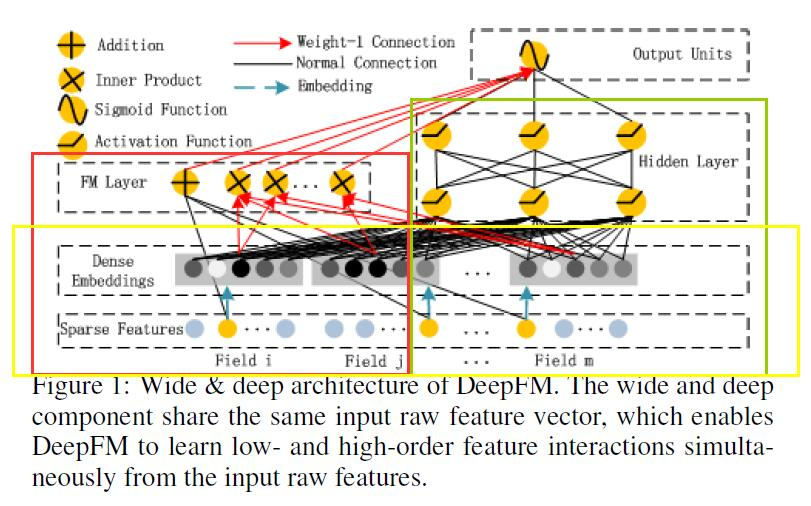
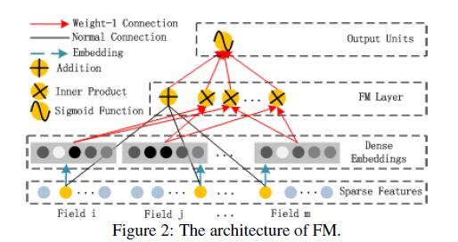
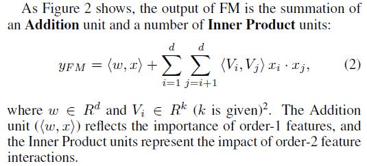
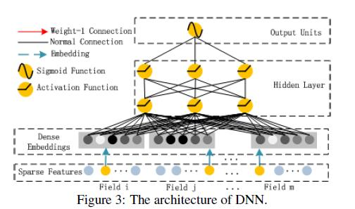
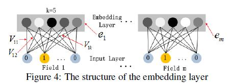

# DeepFM: A Factorization-Machine based Neural Network for CTR Prediction

[论文原文](https://github.com/chenboability/RecommenderSystem-Paper/blob/master/Deep%20Learning/paper/Item%20Silk%20Road%20Recommending%20Items%20from%20Information%20Domains%20to%20Social%20Users.pdf)

> 将FM和deep learning结合，对低维和高维特征进行捕获和学习，完成click-through rate (CTR)。

## 整体架构

左边的FM模型，右边是DNN模型，共用一个输入层和embedding 层
## FM Component

## Deep Component

