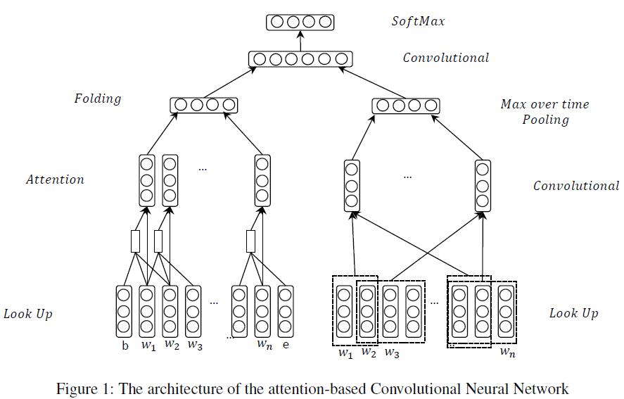
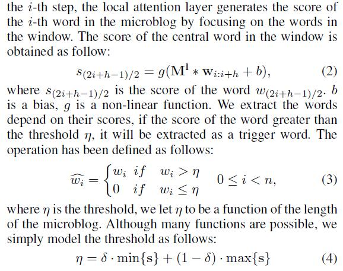
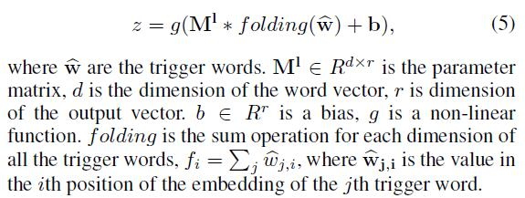
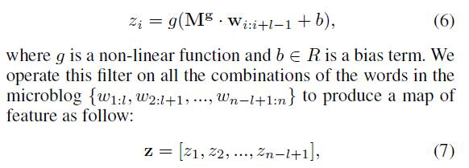
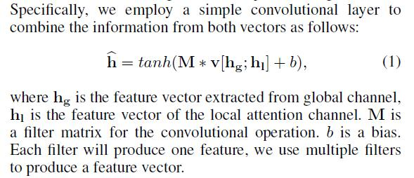

# Hashtag Recommendation Using Attention-Based Convolutional Neural Network

[论文原文](https://github.com/chenboability/RecommenderSystem-Paper/blob/master/Deep%20Learning/paper/Hashtag%20Recommendation%20Using%20A%C2%8Attention-Based%20Convolutional%20Neural%20Network.pdf)

> 标签推荐->多分类问题

## 模型框架

左边是Local Attention Channel，右边是Global Channel。

## Local Attention Channel

第一步： embeddings

第二步：Attention产生

第三步：对Attention产生的trigger words提取特征

## Global Channel

第一步：选择窗口大小l的滑动窗口，产生全局的map of feature

第二步：max-overtime pooling operation，为每一个feature map提取一个最重要的特征

## 结合

