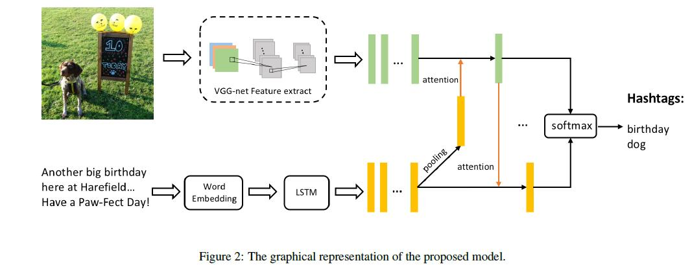
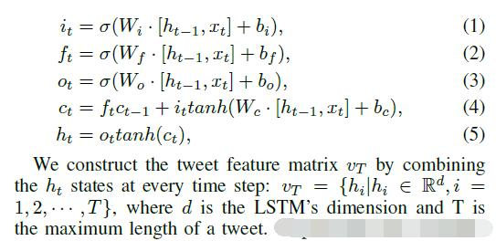
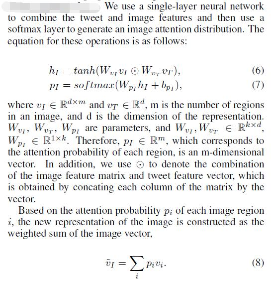
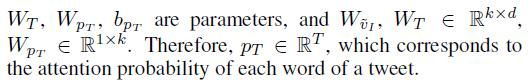
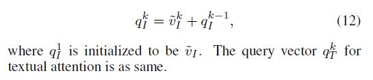
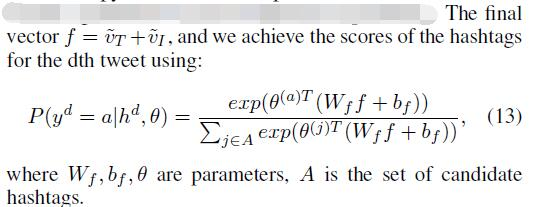
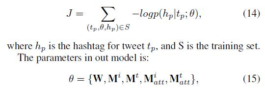

# Hashtag Recommendation for Multimodal Microblog Using Co-Attention Network

[论文原文](https://github.com/chenboability/RecommenderSystem-Paper/blob/master/Deep%20Learning/paper/Hashtag%20Recommendation%20for%20Multimodal%20Microblog%20Using%20Co-Attention%20Network.pdf)

## 模型

## The Proposed Models

### Feature Extraction

#### Image feature extraction

将图片分割成N x N grid，然后对每一个块，利用VGGNet提取D-dimensional feature vector

#### Text feature extraction

对博客文本利用lstm提取特征

### Co-Attention Network

#### Tweet-guided visual attention

#### Image-guided textual attention

#### Stacked co-attention network

for the k-th (where k is greater than or equal to 2) coattention layer, we respectively compute the distribution of visual and textual attention and
generate a new representation for the input image and text
based on the attention probability.

### Prediction

该博客适合标签a的概率：

### Training

目标函数：

