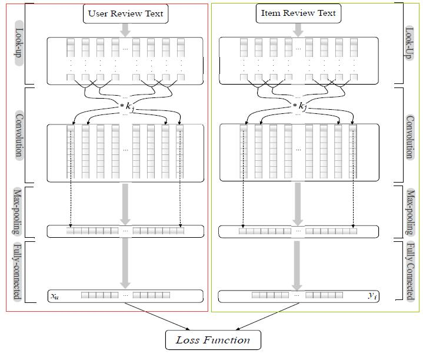
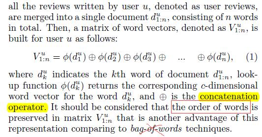
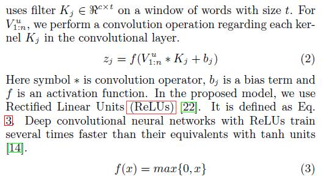
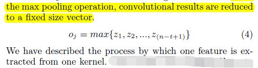
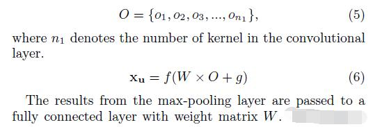
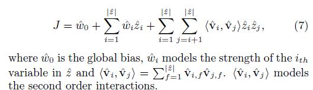

# Joint Deep Modeling of Users and Items Using Reviews for Recommendation

[论文原文](https://github.com/chenboability/RecommenderSystem-Paper/blob/master/Deep%20Learning/paper/Joint%20Deep%20Modeling%20of%20Users%20and%20Items%20Using%20Reviews%20for%20Recommendation.pdf)

## 框架

## Word Representation

word embeddings，对每一个词，形成一个c维的词向量，同时保持词序（向量序列），不是利用词袋。

## CNN Layers

有两个CNN并行网络，一个处理用户信息，一个处理物品信息。包含了三个层：convolution layer, max pooling, and fully connected layer

### convolution layer

有m个神经元，每一个神经元有如下操作：

### max pooling

每一个神经元，用max pooling得到一个值最大的特征，因此整个卷积的结果可以用一个固定长度的矩阵来表示

### fully connected layer

全连接层通过一个W权值矩阵

the outputs of both user and item CNN xu and yi can be obtained.

## The Shared Layer

The Shared Layer用通过Factorization Machine (FM)，连接两个CNN网络的输出结果。

