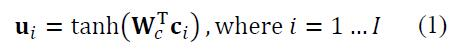
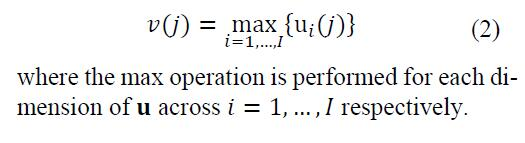
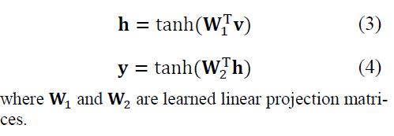
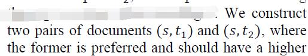
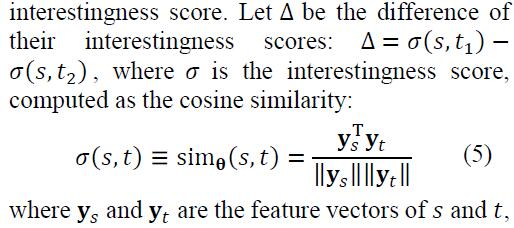
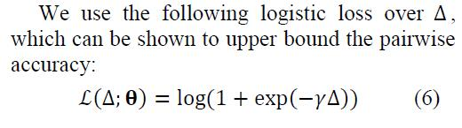

# Modeling Interestingness with Deep Neural Networks

[论文原文]()

> 用户u看来文章a之后，为他推荐文章b

## 框架

## Network Architecture

### Input Layer

每一个词one-hot编码+tri-letter(“#dog#”,->“#do”, “dog”, and “og#”.)目的是如果one-hot的字典库中没有出现的，可以通过tri-letter区分

### Convolutional Layer

窗口大小为3，对每一个词进行卷积

### Max-pooling Layer

对所有词，从每一个维度进行max-pooling，一个维度留下一个最大的词（300维，300个词）

### Fully-Connected Layers 𝐡 and 𝐲

## Training the DSSM

pair-wise rank loss

