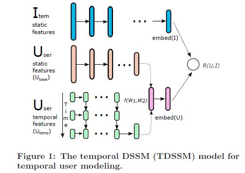
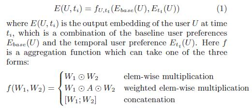
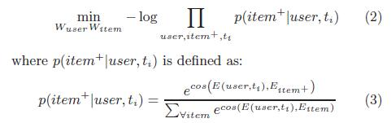

# Multi-Rate Deep Learning for Temporal Recommendation

[论文原文]()

> 利用rnn提取时间性特征，利用dssm计算物品和用户的距离，设计了多速率的计算

## 框架

## user model

结合静态特征（长期）和动态特征（短期）
combines the long-term user preferences which remains relatively stable over time, with the short-term temporal user interests using feedforward neural network.

## 目标函数

利用cos相似度计算物品和用户的距离（dssm），目标函数：

## Mutli-Rate TDSSM

Fast-rate RNNs are used to adapt to very recent user interests

slowrate RNNs are designed to model seasonal user interest shift.

RNNs at different rates are combined using fully-connected feedfoward network.

## TRAINING SPEED-UP USING PRE-TRAIN

预训练：

思路：training a DSSM model in the same way as proposed in [6]. The resulted DSSM is then used to generate embedding for MR-TDSSM inputs. The use of pre-train reduces the size of input feature space by a factor proportional to the ratio between the size of the
original feature space to the size of the embedding space.

