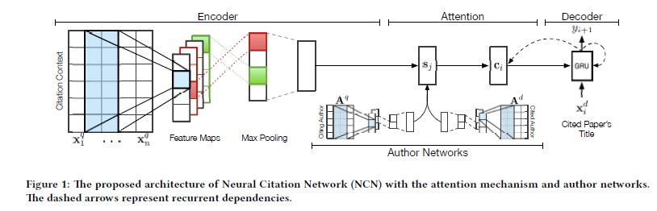
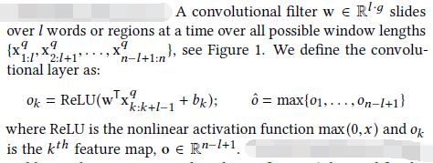
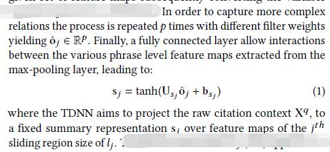
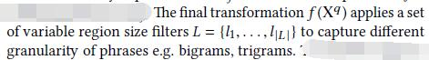
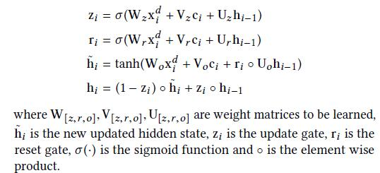
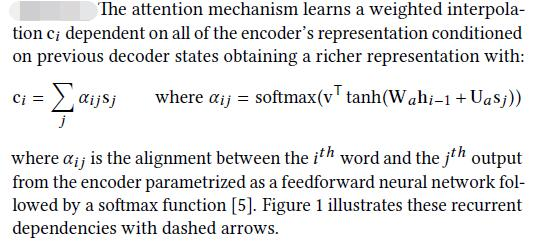
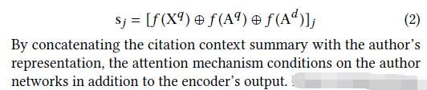
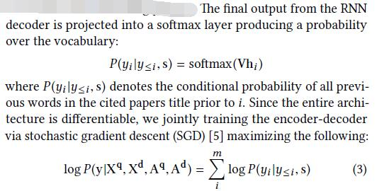

# Neural Citation Network for Context-Aware Citation Recommendation

[论文原文]()

> encoder-decoder architecture

## 框架

## NEURAL CITATION NETWORK

### Encoder

对一个引用的每一个词，用一个窗口大小为l的滑动窗口，进行卷积；然后max-pooling出一个最大的。

针对不同的权值w,重复p次；然后用一个全连接层

针对不同大小的滑动窗口

### Decoder

利用论文的title作为输入，采用Gated Recurrent Unit (GRU)

前一步的输出会反过来影响参数

### Author Networks

额外利用the embeddings of the citation context (query) and cited paper’s (document) author(s)，同样利用Encoder的方法进行处理；最后对结果进行串联。

预测和训练：

