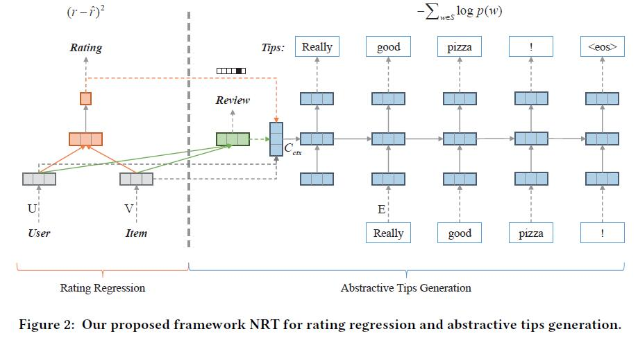
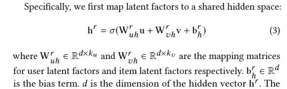
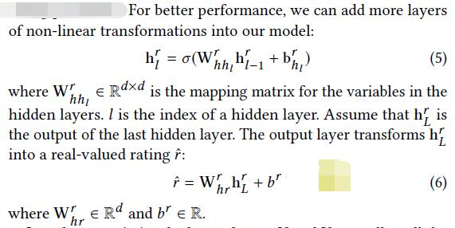
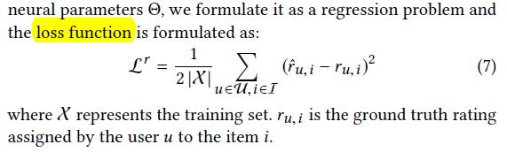

# Neural Rating Regression with Abstractive Tips Generation for Recommendation

[论文原文](https://github.com/chenboability/RecommenderSystem-Paper/blob/master/Deep%20Learning/paper/Neural%20Rating%20Regression%20with%20Abstractive%20Tips%20Generation%20for%20Recommendation.pdf)

## 框架

## Neural Rating Regression（左侧）

MLP模型，第一层：

后面L层：

最后，将预测结果表示为向量形式：（0,0,0,1,0）

模型训练：

## Neural Abstractive Tips Generation （右侧）