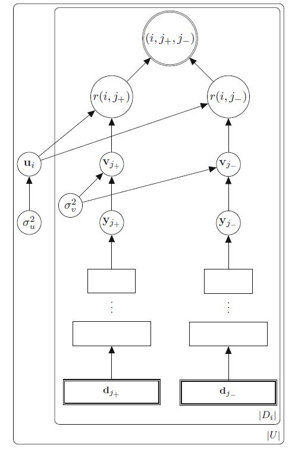
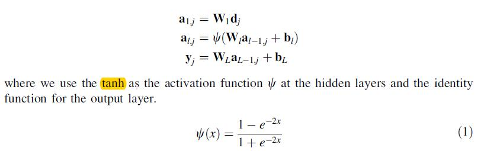
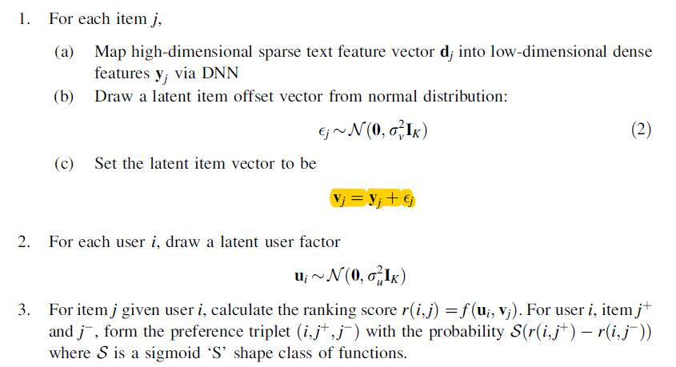
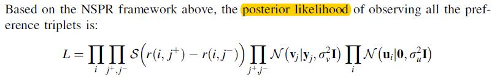
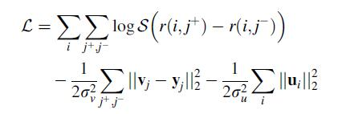

# Neural Semantic Personalized Ranking for item coldstart recommendation

[论文原文](https://github.com/chenboability/RecommenderSystem-Paper/blob/master/Deep%20Learning/paper/Neural%20Semantic%20Personalized%20Ranking%20for%20item%20cold-start%20recommendation.pdf)

## 出发点

利用隐式反馈，结合基于内容的物品和用户信息实现top N推荐

## 模型

输入为用户u的两个物品，正反馈物品dj+和负反馈物品dj-（从剩余物品中随机抽样）的高维向量（如tf-idf），利用DNN网络提取隐式表达yj。如下：

故，评分为：

##参数估计

