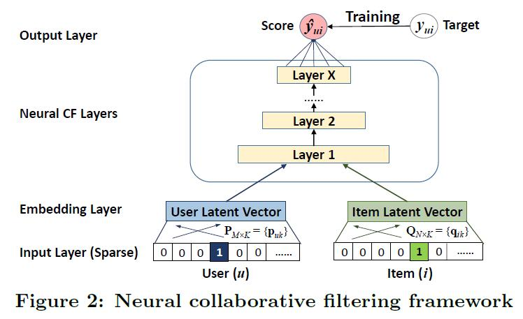
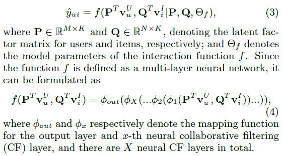
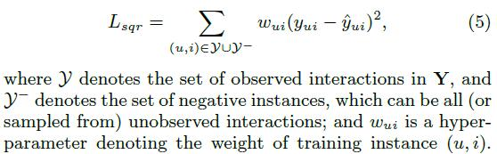
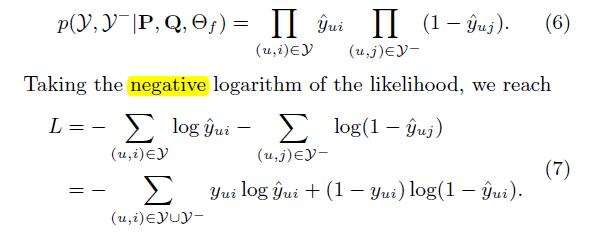
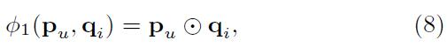
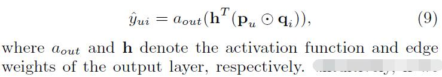
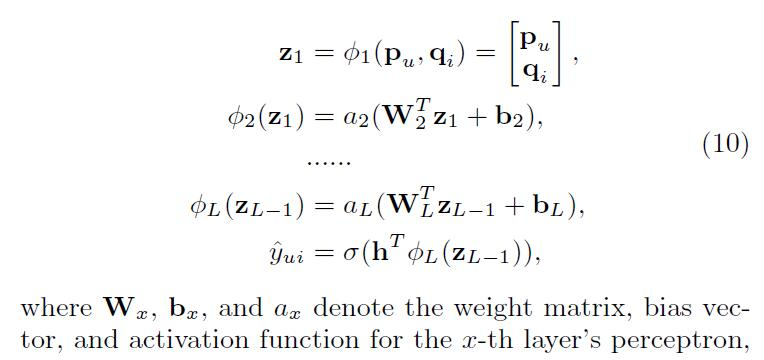
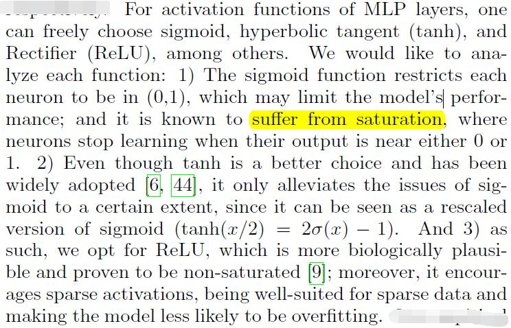
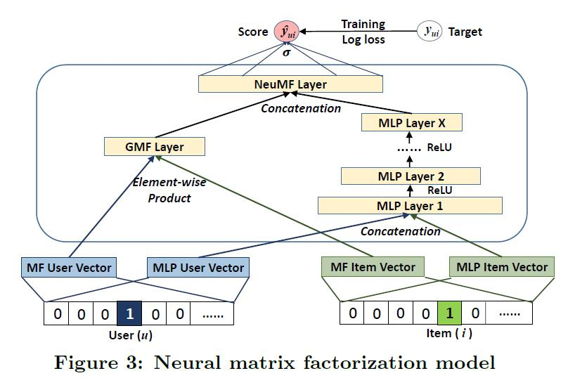
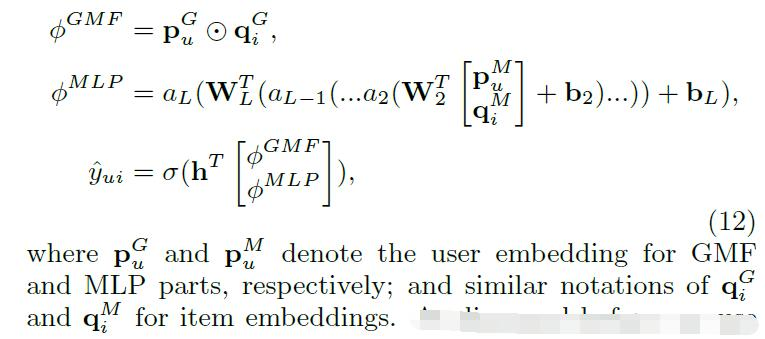

# Neural collaborative filtering

[论文原文](https://github.com/chenboability/RecommenderSystem-Paper/blob/master/Deep%20Learning/paper/ncf.pdf)

## General Framework

整体框架图如下：

NCF's predictive model（中间的MCF层）：

Learning NCF，模型的参数学习，使用pointwise methods：

likelihood function：

上式，为目标函数，即binary cross-entropy loss, also known as log loss。可以通过stochastic gradient descent (SGD)学习。

## Generalized Matrix Factorization (GMF)

mapping function of the first neural CF layer

the output layer

作者文章选择的函数为sigmoid function，函数通过上面的log loss函数学习而来。

## Multi-Layer Perceptron (MLP)

MLP模型的表示：

三种activation function的对比：

网络的架构：塔式
tower pattern, where the bottom layer is the
widest and each successive layer has a smaller number of
neurons

## Fusion of GMF and MLP

结合GMF和MLP的模型：

公式化：

首先，对GMF和MLP单独训练，对这两个模型的预训练通过Adaptive Moment Estimation (Adam)方法（基于动量）。预训练之后，获得收敛后的参数作为结合GML和MLP模型的NeuMF的初始参数，采用vanilla SGD方法训练模型。

