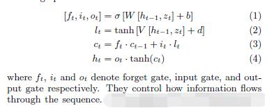
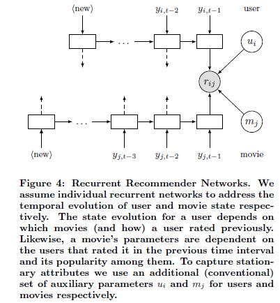
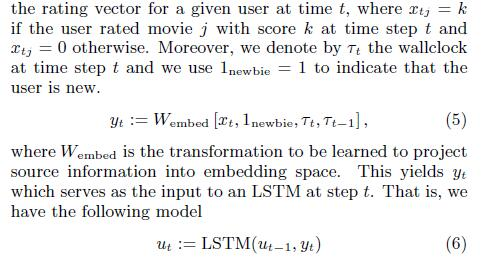
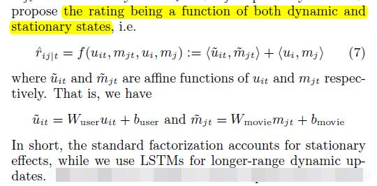
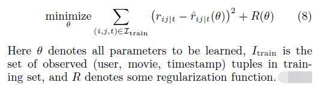

# Recurrent Recommender Networks

[论文原文]()

## Recurrent Deep Networks

LSTM模型：

## RRN

框架：

### User and Movie State

以用户空间为例：

### Rating Emissions

rating包括两部分，静态和动态：

### Rating Prediction

extrapolated states：take the latest observations as input, update the states and make predictions based on the newly updated states.

### Inference

优化方法：subspace descent