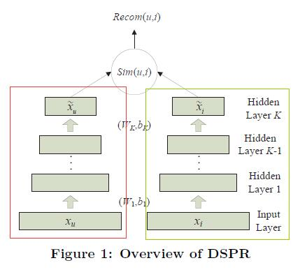
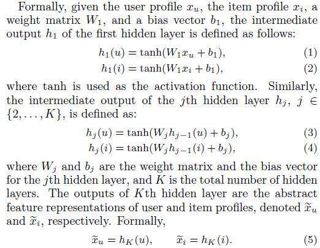
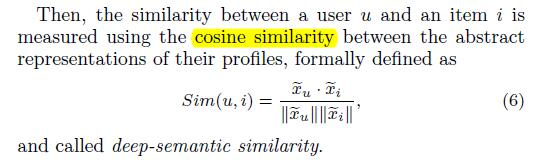
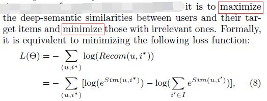
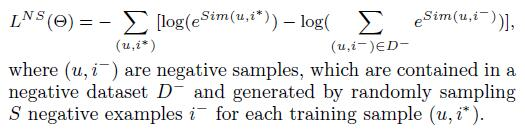

# Tag-Aware Personalized Recommendation Using a Deep-Semantic Similarity Model with Negative Sampling

[论文原文]()

## 框架

两个神经网络，一个用于提取用户信息，一个用于提取物品信息，全部提取到同一个标签空间，因此两个神经网络共享参数。

## DSPR WITH NEGATIVE SAMPLING

### DSPR

两个神经网络的表示：

计算deep-semantic similarity：

利用softmax进行top-n推荐:

优化目标函数：

### Negative Sampling

采用Negative Sampling优化后的目标函数：

