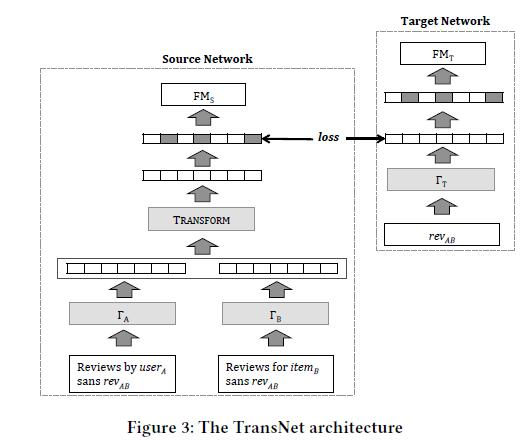
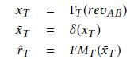
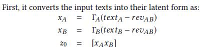
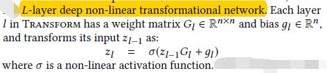
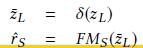
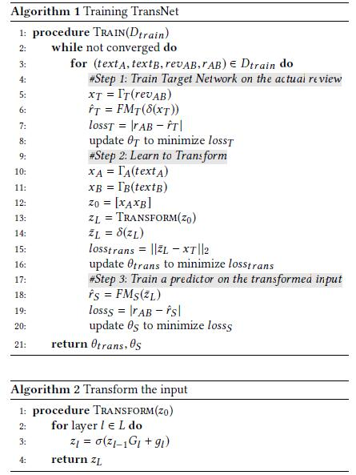
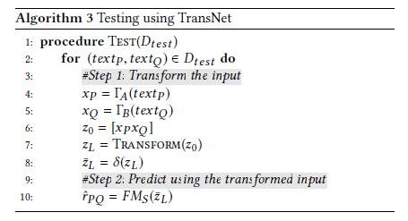
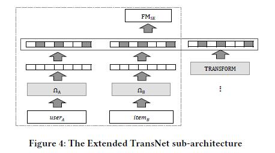

# TransNets: Learning to Transform for Recommendation

[论文原文](https://github.com/chenboability/RecommenderSystem-Paper/blob/master/Deep%20Learning/paper/TransNets%20Learning%20to%20Transform%20for%20Recommendation%20by%20Rose%20Catherine.pdf)

## 解决问题

DeepCoNN有一个问题，就是在测试的时候，对弈某一个物品，用户一般是没有关于该物品的评论信息，因此其实模型的效果一般。

## 框架

a Target Network that processes the target review revAB and a Source Network that processes the texts of the （userA; itemB） pair that does not include the joint review, revAB

## Target Network

the Target Network uses a CNN Text Processor, and a Factorization Machine, to predict the rating as:

## Source Network

The Source Network is like the DeepCoNN model with two CNN Text Processors, 􀀀A for user text, textA - revAB, and 􀀀B for item text, textB - revAB, and a Factorization Machine, FMS , but with an additional Transform layer

上面这一步和deepCoNN是一样的，只是将text的内容减去revAB。接着，通过一个L层的深度非线性装换网络，如下：

第L层的输出zL是对revAB的近似。

## training

3部曲：

1. 利用真实的revAB（review）学习到的rT（带尖帽）和rAB（评分）来训练target network。最小化rAB和rT（带尖帽）差的L1。
2. 利用用户和物品的text经过深度学习学习到的隐式表达zL(带一字帽)和真实的revAB在target network学习到的表达xT来训练Source Network。最小化zL(带一字帽)和xT差的L2。
3. 利用rAB（评分）和FM得到的rS（带尖帽）来学习FM的参数。最小化rAB（评分）和rS（带尖帽）差的L1。

## testing

只利用Source Network

# 其他

1. 训练时，最小化每一步的loss，而不是整体loss
2. 整个网络是一起训练，一起收敛，而不是一部分一部分训练，逐个收敛
3. 对用户和物品两个子网络的参数不共享（与deepCoNN一样）
4. 带dropout
5. 模型拓展，加入物品和用户信息，如图

