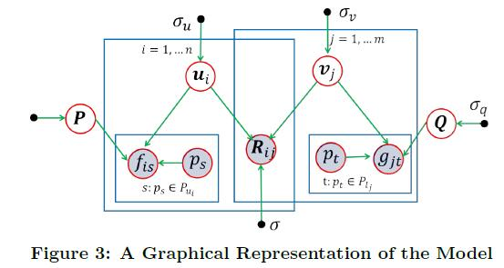
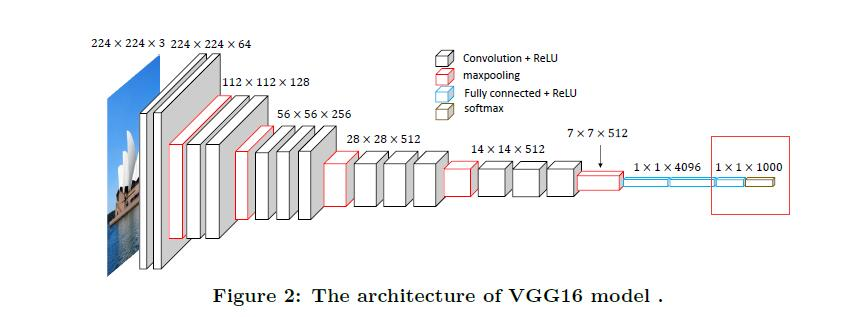
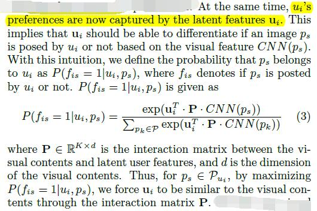
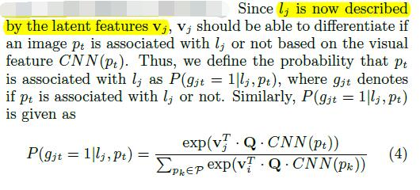
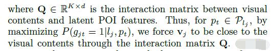
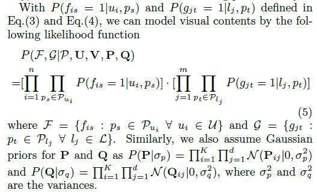
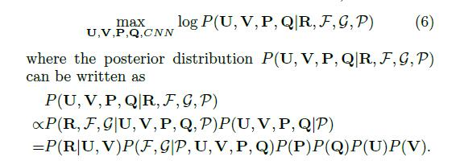

# What Your Images Reveal: Exploiting Visual Contents for Point-of-Interest Recommendation

[论文原文](https://github.com/chenboability/RecommenderSystem-Paper/blob/master/Deep%20Learning/paper/What%20Your%20Images%20Reveal%20Exploiting%20Visual%20Contents%20for%20Point-of-Interest%20Recommendation.pdf)

> 利用CNN提取图片特征，POI推荐

> Existing POI recommendation methods focus on four aspects, i.e., temporal patterns, geographical influence, social correlations and textual content indications.

## 框架

## A Basic POI Recommendation Model

利用传统的PMF模型

## Extracting and Modeling Visual Contents

提取图片特征从CNN模型为去掉后两层的VGG16

### 用户隐式特征

对某一用户u的所有图片提取特征，用于描述用户隐式特征

### 地点隐式特征

对某一地点l的所有图片提取特征，用于描述地点隐式特征

### 整体建模

## The Proposed Framework–VPOI

