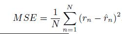
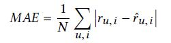

# Evaluation Protocols

## Top-n

1、 Hit Ratio (HR): measures whether the ground truth item is present on the ranked list.

2、 Normalized Discounted Cumulative Gain (NDCG): accounts for the position of hit.

3、 Precision@N: the proportion of top n generated tags that appear in the user tags

4、 Recall@N: the proportion of the user tags that appear in the top n generated tags

5、 Accuracy@N： is computed as 1 if at least one of the top n generated tags is present in the user tags and 0 otherwise [ConTagNet]

6、 Mean Average Precision (MAP)

## Rating Prediction

1、 Mean Square Errors (MSE)

2、 Root Mean Squared Error (RMSE)

3、 Mean Absolute Error (MAE)

