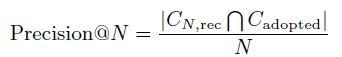
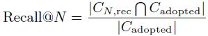
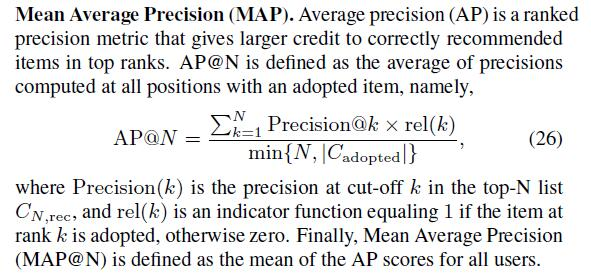
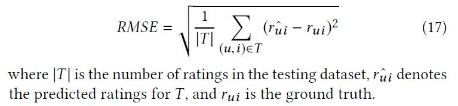

# Evaluation Protocols

## Top-n

1、 Hit Ratio (HR): measures whether the ground truth item is present on the ranked list.

2、 Normalized Discounted Cumulative Gain (NDCG): accounts for the position of hit.

3、 Precision@N：

4、 Recall@N：

5、 Mean Average Precision (MAP)

## Rating Prediction

1、 Mean Square Errors (MSE)

2、 Root Mean Squared Error (RMSE)

