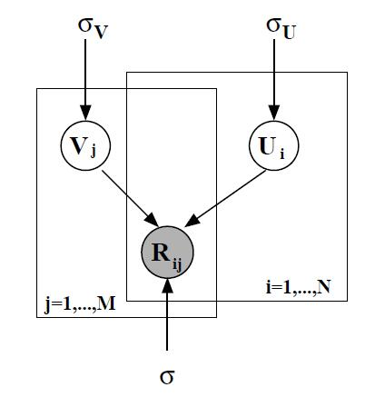
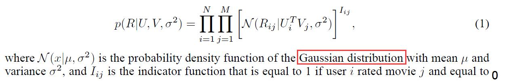
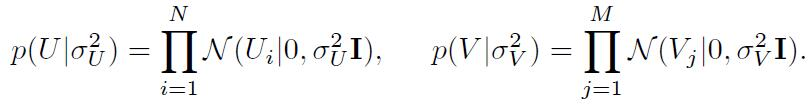
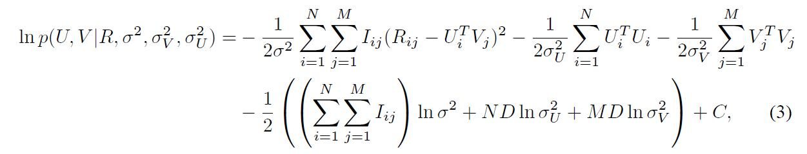
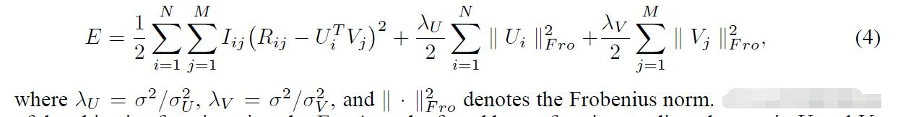
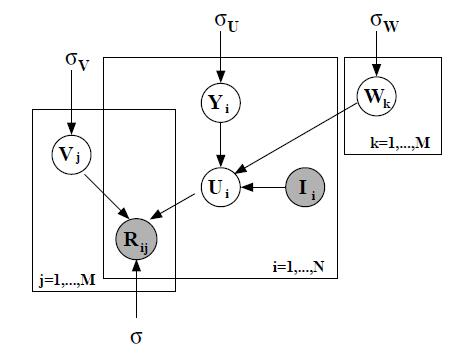
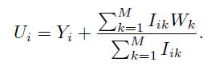
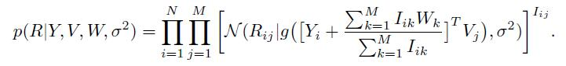
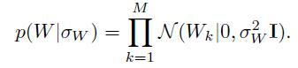
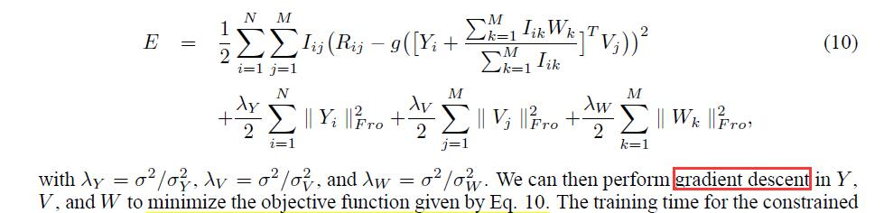

# Probabilistic Matrix Factorization

[论文原文](https://github.com/chenboability/RecommenderSystem-Paper/blob/master/Matrix%20Factorization/paper/Probabilistic%20Matrix%20Factorization.pdf)

CF的弊端：

- 大数据集下，可拓展性差
- 对于评分少的用户（冷启动），推荐效果差

## Probabilistic Matrix Factorization (PMF)

PMF的图模型：

带高斯噪声的概率线性模型：

后验概率：

最大化上式等价于最小化下式：

求解方法可以通过对U和V执行梯度下降。为了避免预测的评分值超过评分允许范围，应该进行归一化：

其中，g(x)为逻辑函数，g(x) = 1/(1+exp(-x))

## Constrained PMF

图模型如下：

用户i的特征向量：

其中，I是indicator matrix，当用户i对物品j评分过时，，否则等于0。分母起到计数的作用。W是latent similarity constraint matrix，W的第i列，表示该用户历史评分的物品影响。
**因此，有着相似历史评分的用户，他们的特征向量有着相似的先验分布。**
Y是这先验分布均值的偏差（在PMF下，由于先验分布均值=0，因此U=Y）

因此，条件分布如下：

因此，最小化下面的式子：

