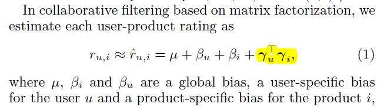
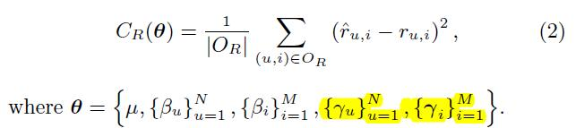
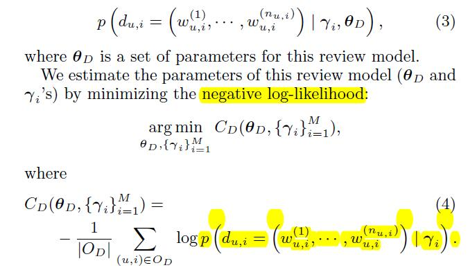
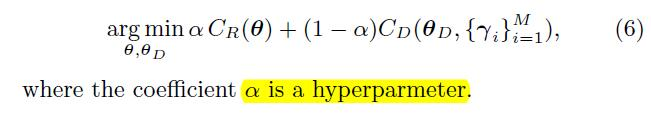
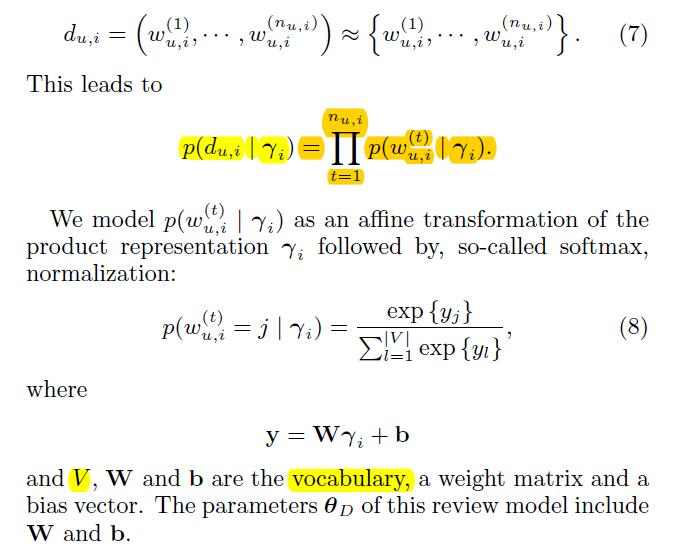
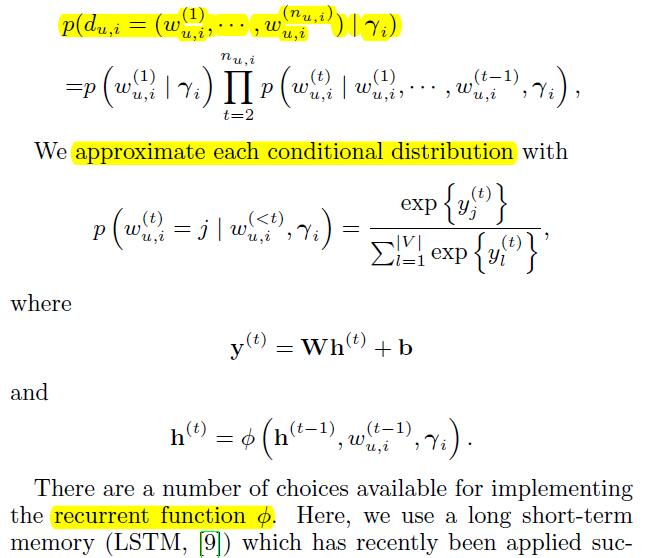
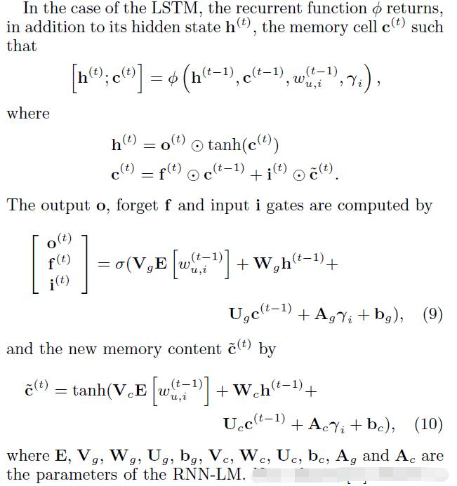

# Learning Distributed Representations from Reviews for Collaborative Filtering

[论文原文]()

## Taming the Curse of Data Sparsity

克服数据的稀疏性带来的问题，方法有以下几种：

1. 在损失函数中添加正则化项；
2. 将矩阵分解放入概率框架，例如PMF；
3. 多任务学习

## 任务一： Rating Predict

基于矩阵分解：

参数估计的损失函数：

## 任务二：Review Modeling

## 多任务目标

## 模型一：BoWLF: Distributed Bag-of-Word

假设：review是词袋模型.故dui可以通过以下方式计算：

## 模型二：LMLF: Recurrent Neural Network

假设：review每一个词保持词序，利用RNN（LSTM）语言模型.故dui可以通过以下方式计算：

LSTM模型：

