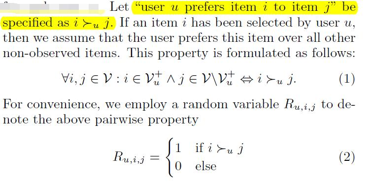
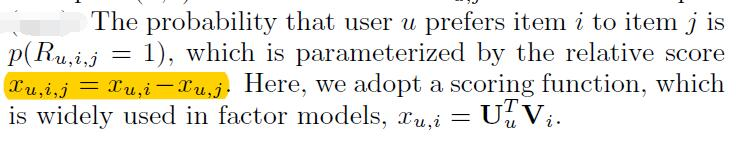
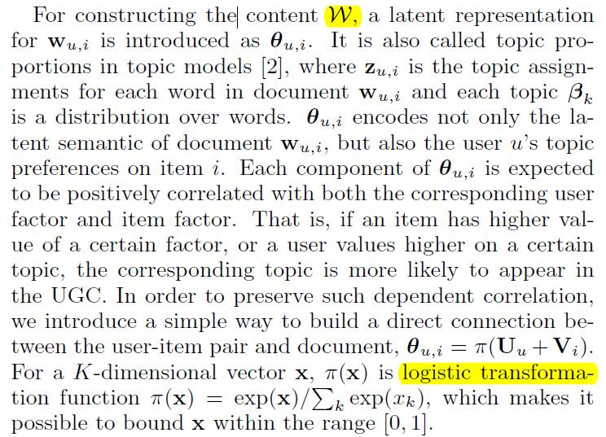
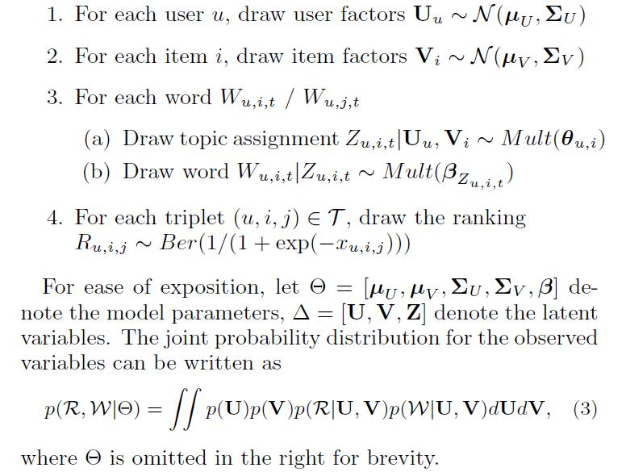
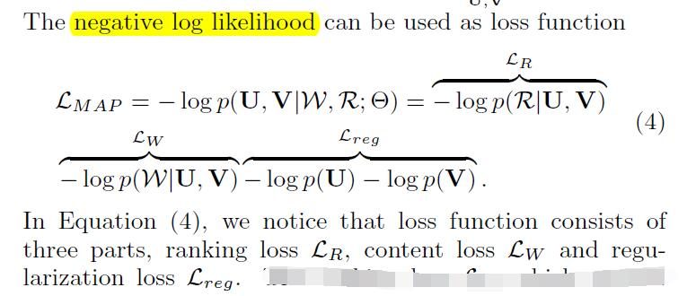

# Personalized Semantic Ranking for Collaborative Recommendation

[论文原文]()

## 模型

## Personalized Ranking from Implicit Feedback

利用隐式反馈信息，采用pairwise的方法

## 任务一：Ranking

## 任务二：Constructing the Content

## Generative process

## 多任务目标-最大化后验概率

