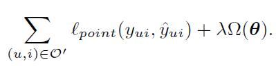
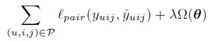
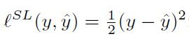
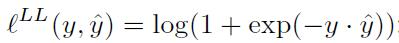
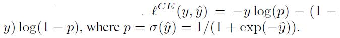

# Object Fuction

## Point-wise objective function

## Pair-wise objective function

Pair-wise functions are usually considered to be more suitable for optimizing top-N recommendation performance.

## Loss functions

1、 SQUARE LOSS

2、 LOG LOSS

3、 HINGE LOSS

4、 CROSS ENTROPY LOSS

5、 Reconstruction Error
（Autoencoder use）

