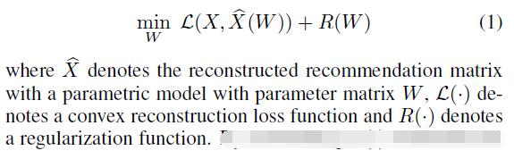
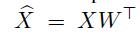
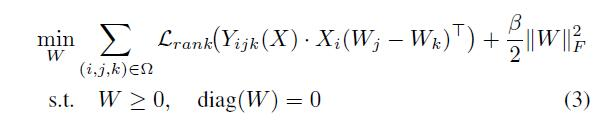
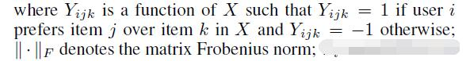
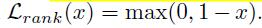
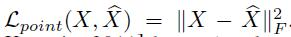
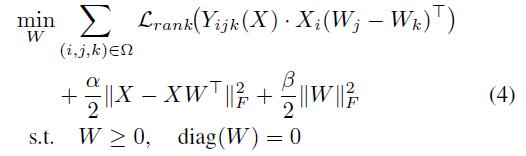
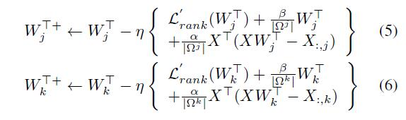
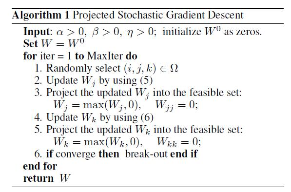

# Improving Top-N Recommendation with Heterogeneous Loss

[论文原文]()

> 结合pairwise ranking loss 和 pointwise recovery loss两种损失函数，求解top-N问题

## A General Learning Framework for Top-N Recommendation

Top-N问题的一个一般性框架：

通过改变不同的L（.）函数，可以获得不同的目标函数。

## Novel Heterogeneous Loss

### 结合pairwise ranking loss

利用线性重构函数(linear reconstruction function)，如下：

可以得到下式（带约束条件）

The loss function Lrank(·) aims to
encode the pairwise preference ranking divergence between
the given matrix X and the reconstructed matrix X'. 选择了max-margin hinge loss function，如下：

### 结合pairwise recovery loss

同理，利用线性重构函数，可以得到pointwise recovery loss如下：

因此，公式（3），可以进一步修改成下式：

## Optimization Algorithm

采取projected stochastic gradient descent (SGD) algorithm对公式(4)进行优化。梯度更新：

算法：

