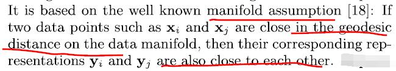
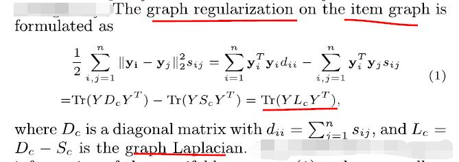
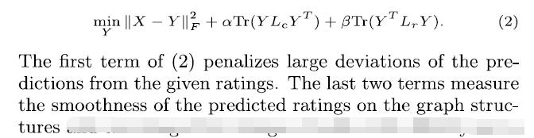
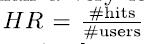
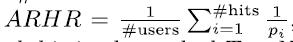

# Top-N Recommendation on Graphs

[论文原文]()

> Top-N Recommendation based on Graphs

# User and Item Graphs

利用图的形式来表示用户和物品。

基于一个manifold assumption：

物品图（无向加权图）的规则化表示：

是对称邻接矩阵，矩阵元素表示两个点的权值，代表物品的相似度。

物品的显式打分信息的相似度，利用的是cos相似度；而隐式反馈的相似度使用的是Jaccard系数。

# Model

目标函数：

其中，X是原用户对物品的评分矩阵，Y是图规则化后的表达形式。

# Evaluation

评价指标：

1. 

2. 

评估维度：

1. 参数影响；
2. top-n的n值；
3. 矩阵重建的恢复程度：矩阵稠密度、非0元素的恢复程度和均值。